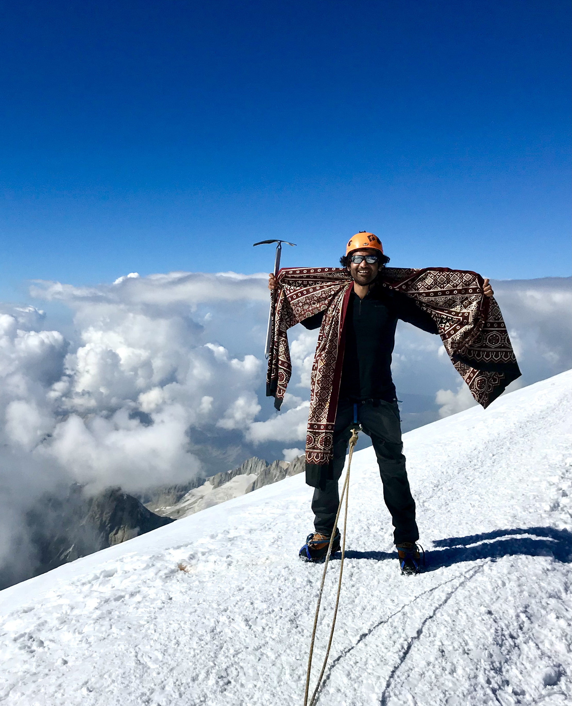

Born in Pakistan, I have been coding since I was 12 years old. Starting with quick basic and later on with VB6 & C++, I formed an early interest in programming games. By the age of 17, I met the co-founder of my first company and started a game development company. After 5 years of creating games unsuccessfully, we pivoted the company to experiential marketing projects which gained significant traction and resulted in the business creating 100K+ USD per annum in revenue.

Due to personal circumstances, I decided to move to the Netherlands. I joined Sense Health as an Android engineer in 2016 and within a year I took over the role as CTO and helped scale the company from 15 people to 50 people. Being end-responsible for the product and involved in the general management of the company, I saw the company grow to multi-million ARR. Eventually I took over the role of CEO - International to bring our product to international markets helping bring it to Beligum, Ukraine, Brazil and Ireland. See [NiceDay](./projects/niceday) for more details.

I enrolled in SZABIST university for my bachelor's in media sciences but never finished my undergrad studies. One of my accomplishments that I am proud of is that I was invited to the same university that I dropped out of several years later to teach a game development course for final year computer science students.

In the last 15 years, I have gained experience running 1-50 people companies and seeing them through from startup to scale-up phase. With my professional technical experience ranging over a decade, I am an engineer and tinkerer at heart who is passionate about technology and complex social problems. Having end to end experience building and selling products, I have grown a deep understanding of building businesses that focuses on creating sustainable value while empowering the people working on the vision. I lean towards building companies that prioritise purpose over profit and are [Steward Owned](https://purpose-economy.org/en/whats-steward-ownership/). 

When I am not behind my computer I like to be in the great outdoors and enjoy mountaineering and rock climbing. Having lived in the Netherlands for quite a few years I have learned to converse well enough in Dutch.

Feel free to reach out via email: hello@umarniz.com or [plan a call](https://cal.com/umarniz).

## Pictures

<figure >

</figure>

<figure >

</figure>