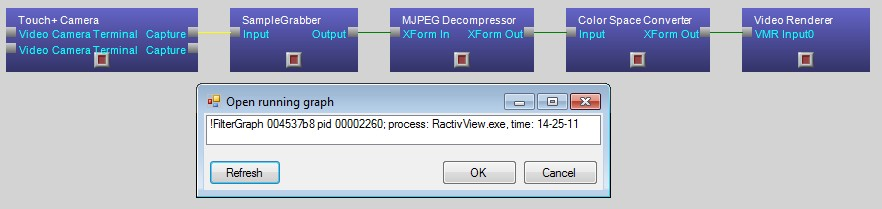
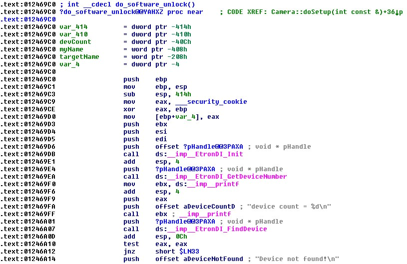
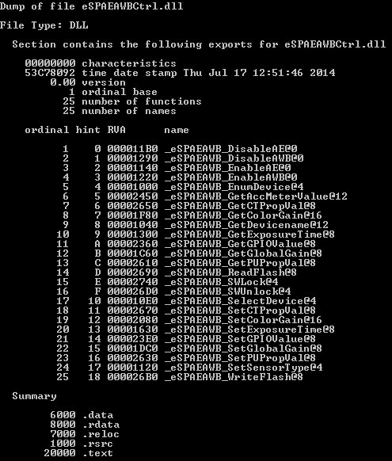
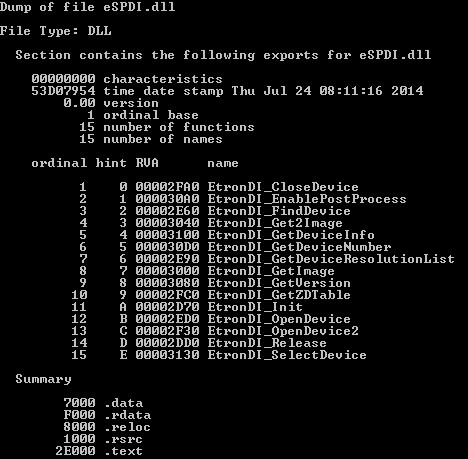
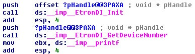

When we at [Nerdiacs](http://nerdiacs.com/) first saw the kick starter project for [Touch+](http://www.ractiv.com/) I was more interested in the hardware for the project then the software. Wide FOV stereo cameras in a neat little usb bundle isn’t bad for doing some vision based research.

After receiving a few pieces of the touch+ hardware we realized that the project was stuck in development limbo, no drivers, no access to hardware and no response to the community and hence I decided to hack the touch+ video stream myself.

I started off with the only executable shared to the public by Ractiv, hidden under facebook comments to test the ractiv hardware. It proved that atleast my hardware isn’t faulty and something can be done with it.

I started off by figuring out what they were using to pull the video data from the device. My first guess was the UVC library which is used by a lot of devices under Mac and Linux, but a quick test by deleting the library and running the executable showed that it wasn’t using anything from the UVC lib. Just a remnent from experiments perhaps.

My second guess was Direct Show. Running the app and running [GraphEditorPlus](http://www.infognition.com/GraphEditPlus/) (which is an awesome tool for direct show first timers like myself) which has an option to connect to running direct show instances I figured out that it was using direct show indeed.

<figure>

</figure>

But if it was indeed using direct show to video streams, then why was by graph returning null data?

I figured the shortest way to figure out the video stream was to disassemble the Camera Viewer app. I used [IDA by Hex Rays](https://www.hex-rays.com/products/ida/) to disassemble the code and the cherry on top was the fact that the executable had debug symbols in the directory itself.

Going through the assembly code I noticed that the app was calling a function called do\_unlock\_software when opening the camera stream and calling functions like **eSPAEAWB_SWUnlock**.

<figure>

<figcaption>Variable names thanks to the debug symbols</figcaption>

</figure>

Analyzing the disassembled file showed that the camera was actually unlocking the camera before creating the direct show streams. This made sense and was a reasonable explanation for the null stream i was getting.

To test my theory, I put a debug point at the end of the do\_software\_unlock function and ran the application. When it paused on the breakpoint, I ran my direct show graph I had created in GraphEditPlus and voila the stream started working.

Now the only task was to pull these functions into my own code before creating the direct show graph and we should have the video stream. I looked around at what exact functions where implemented in the unlock function and all calls were being done to 2 dll files. eSPAEAWBCtrl.dll and eSPDI.dll.

Now, all I needed to do was to implement functions from the DLLs into my code to unlock the stream before creating the direct show filters. Todo that I first exported the headers for the dlls using dumpbin which is accompanied in visual studio.

dumpbin /exports `<name of dll>`

Returned this:

<figure>

<figcaption>The functions exposed in this dll. The @ value at the end indicates parameter bits.</figcaption>

</figure>

Having the parameter made it easy to figure out parameter using just intuition, but the second DLL eSPDI.dll had undecorated functions and returned this:

<figure>

</figure>

So how do we figure out the parameters being passed, and even the number of parameters being passed and return from each function? To do that we need to go back to the disassembly and figure out hints from the assembly code.

<figure>

</figure>

This snippet on the left is calling the function **EtronDI_Init** and **EtronDI_GetDeviceNumber**.

When calling the function to pass the parameters the assembly code would need to push the variables onto the stack before going into the function. As we can see above before calling the function **EtronDI_GetDeviceNumber** the code is pushing just one variable the pHandle variable onto the stack.

Thanks to the debug symbols we already know pHandle is a void* pointer, so all the function definition for **EtronDI_GetDeviceNumber** would be:

> **\_EtronDI\_GetDeviceNumber(void*)**

But when calling the function **EtronDI_Init** the assembly code is calling push offset pHandle. The push offset function actually pushes the pointer to the object. Hence the definition would be:

> **\_EtronDi\_Init(void**)**

With this logic, we can figure out the parameters alright but what about the return type? In assembly when we return from a function, the return object is always on top of the stack. Hence the line after calling **EtronDi_Init**:

**add esp, 4**

This offsets the stack pointer by 4 bytes meaning that the return type has a size of 4 bytes. This means the return is either a 32 bit pointer or an integer type, intuition tells us it should be an integer return type which fits quite nicely when implemented.

Using this flow of logic I was able to deduce the function calls to all the functions being used by **do\_software\_unlock**.

A note when calling the dll functions, the **eSPAEAWBCtrl** dll uses __stdcall calling convention whereas the **eSPDI** dll uses the __cdecl calling convention.

Even after calling all the functions in the correct order the stream continued to return null which I later found out was because the function **eSPAEAWB_SWUnlock** requires the value “263" to be passed to it instead of the device ID which would make intuitive sense.

After unlocking the video stream, I connected the Direct Show graph to the code and finally got access to the video stream.

The code for the hack is available here:

[https://github.com/umarniz/TouchPlusLib](https://github.com/umarniz/TouchPlusLib)
  