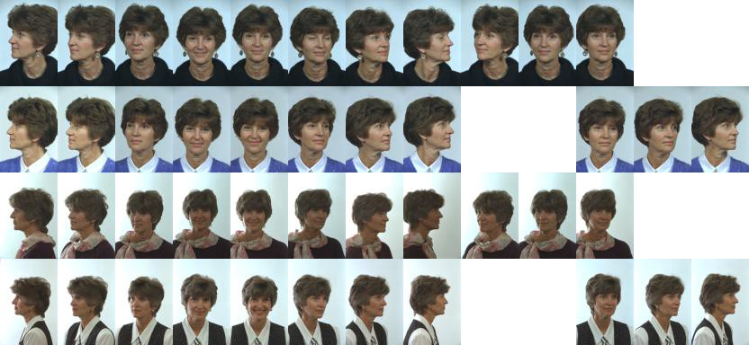
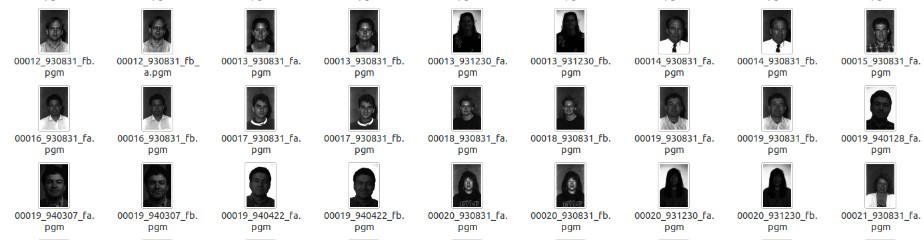
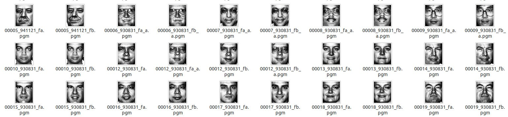

Working in experiential marketing, I wanted to be able to target campaigns more intelligently than conventional wisdom and use technology to help classify live viewers. The idea was to have camera’s on outdoor activations at eye level and classify in real time the age group, gender and ethnicity of each viewer.

Though such systems are not new and have already been done by companies like [Intel (Aim Suite)](https://aimsuite.intel.com/) and [Quividi](http://www.quividi.com/) but it seemed like a fair start before extending the module with systems like [Facebook’s PANDA](https://research.facebook.com/publications/487837187989457/panda-pose-aligned-networks-for-deep-attribute-modeling/) to enhance the accuracy by detecting attributes from objects the person is carrying (clutch purse, pants, skirts, etc) to further increase the accuracy of the system.

It has been a year since I worked on the system and this post is to document the process and how I went about doing things.

After reading lots of research papers on the problem set at hand I knew using an SVM could actually work fair enough for the first part of image classification like Aim Suite does by detecting faces via HAAR classifier and using feature detection + SVM to classify between gender (ear detection, 85% of images where the software detected ears were male) and similarly eye tracking to detect how long the viewer was watching the advertisement.

But such assumptions pile up to increasingly inaccurate result. My approach was to train multiple DNNs each classifying an attribute (age, gender and ethnicity). To start experimenting on this I used the amazing [Caffe Framework](http://caffe.berkeleyvision.org/) which is open source thanks to the brilliant work by the guys at [Berkley](http://bvlc.eecs.berkeley.edu/). The Caffe framework now uses [cuDNN](https://developer.nvidia.com/cudnn) which is NVIDIAs framework for accelerated deep learning and boosts the performance of the framework incredibly.

I used Caffe under Ubuntu 14.0 as it made far more sense to use linux over windows for compiling and working with such a framework. Firstly I would really recommend you to have a decent NVIDIA GPU for Caffe as training the models without CUDA is terribly slow. I used a 750 GTX TI for all experiments and had very good train times.

To setup Caffe, I pulled the [latest branch](https://github.com/BVLC/caffe/tree/master) off Github and followed the [instructions](http://caffe.berkeleyvision.org/installation.html) on the website. A few gotcha’s under linux were:

1.  Make sure you have stable NVIDIA drivers setup for Ubuntu. It took me 3 tries to get drivers that wouldn’t crash the windowing system.
2.  Caffe has lots of dependencies and packages like ATLAS have even more sub depencies. It will take time to compile and make them all for your system.
3.  Cuda requires you to add LD\_LIBRARY\_PATH. I added it under user profile instead of global bash so that tools like pycharm could pull it too.

After I built Caffe via make, I ran all the tests to make sure the dependencies are working fine. I used Caffe Python bindings to do all the work as Caffe allows you to create NN models and create test/validation sets in text files which it then parses and creates the model from. Using python bindings for Caffe helped me a lot as it allowed me to rapidly change models or data sets and test the results.

Once all the tests are successful I had Caffe ready to roll on my system. Next I tried running an example from Caffe. The [Web Demo](http://demo.caffe.berkeleyvision.org/) for Caffe comes bundled with the caffe source, instructions for setting it up are available [on the wiki](http://caffe.berkeleyvision.org/gathered/examples/web_demo.html).

After setting up Caffe, I started exploring different data sets to train using the same Convolution Neural Net model that Caffe used for Image Net Classification. I explored a lot of different face data sets including [Face Tracer,](http://www.cs.columbia.edu/CAVE/databases/facetracer/) [FDDB,](http://vis-www.cs.umass.edu/fddb/) [LFW](http://vis-www.cs.umass.edu/lfw/) and finally locking down on the [FERET Database](http://www.itl.nist.gov/iad/humanid/feret/).

The FERET Database has 1208 different people with multiple pictures for each person variating in yaw, pitch, roll of the head, facial expressions and lighting conditions.

<figure>

<figcaption>Example montage of a subject</figcaption>

</figure>

To work with the FERET database firstly I need to start filtering down data that I need. I created a quick python script to read the ground truths and create a compilation of only frontal images.

Now, after I have all the frontal images in one place I need to figure out what kind of data I need to extract from these images to use as the input to the neural net. To understand this remember that a neural net just takes a 1D array of values and trains itself onto that array.

So I need to find out what kind of array I want to create to represent this image. There are many approaches to this some prefer using data from edge detection algorithms or using feature descriptors like SURF, SIFT, HOG. I planned to use raw image pixels as descriptors instead.

There are both pros and cons of using raw image pixels as input for DNN but the ground truth from FERET had very tight face rectangles and the eyes of subjects were almost aligned at the same position in all the images after cropping. This would actually improve my odds as the nerual net would be able to pick up smaller changes and have less variance.

To crop all the frontal images I created a quick python script that would pull the face rectangle data from the ground truth and crop the images accordingly using image magick. Now that I have the images cropped they still have color which makes it more complex for us to train the DNN which requires a 1D array and makes the DNN more susceptible to error.

To normalize the images, initially I just merged the RGB channels and normalized the output. The result without the cropping was:

<figure>

</figure>

As you can see the images are quite dark and are loosing out on a lot of data. To enhance detail, I cropped the images to just the face rectangle and then normalized the histogram. It is important to crop the image to the face area before doing histogram normalization as otherwise background pixels would be accounted for in the histogram. The final conditioned images looked like:

<figure>

</figure>

As you can see the final images are covering the entire RGB range quite nicely and hence have a lot more detail visible. Secondly, Thanks to all the pictures being frontal the eye coordinates of all the images are almost exactly at the same position.

After conditioning the images, I used the train/validation model that came with caffe and was used to train the image net classifier. The model is used to create the internal DNN structure and was very well suited to a generic classifier like the one used on image net and hence would make sense to use as a testing model for a gender classifier.

When training a model in caffe we need to split the dataset into two parts, training and validation dataset. There are multiple techniques to split the model into a train/validation sets, I used 90% of the images to train and 10% to validate the model.

To create the sets, I created a python script that would check the ground truth for each subject and determine whether the person was a male or female and then list them down into a text file like so:

> 00619\_940928\_fb.pgm 0  
> 00402\_940422\_fb.pgm 1  
> 00528\_940519\_fb.pgm 0  
> 00597\_941031\_fa.pgm 0  
> 00317\_940422\_fb.pgm 1  
> 00429\_940422\_fb_a.pgm 1

Where the 1/0 at the end suggest what label to give to the data in the DNN. I just had 2 categories and hence 0 was male and 1 was female. A similar validation file was created which was passed to caffe for training.

After training the data set for 20,000 iterations, I managed to achieve an accuracy of ~66% of gender classification and had similar results during deployment to test with end users.

To test this in real-time I created a quick OpenCV application that would detect faces using the HAAR classifier, cut the face region from the image and pass the image to a python script which categorized the image in real-time and returned the gender. The entire experiment worked well during real-time usage, and I was highly impressed by caffe’s performance during run-time.
  