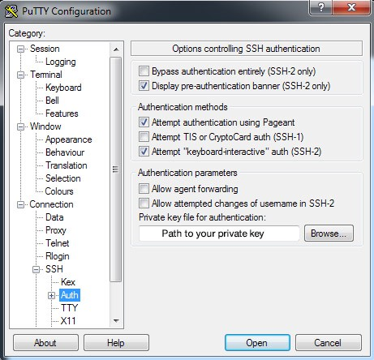
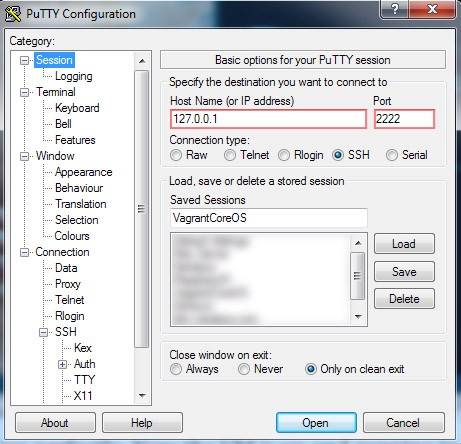
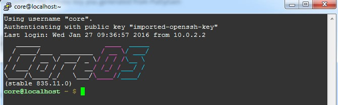

I was doing the [Google’s deep learning course on Udacity](https://www.udacity.com/course/deep-learning--ud730) today and noticed that [TensorFlow](https://www.tensorflow.org/) doesn’t install under Windows and a lot of people were complaining that they were stuck because of this.

This is a quick guide to running a TensorFlow Docker image under Windows. As Docker runs on Linux containers we would need to run a Linux Virtual Machine(VM) to be able to run Docker images. My favorite tool for running VMs quickly under windows is [Vagrant](https://www.vagrantup.com/).

So first install Vagrant and open command prompt. Next create an empty folder where you would like Vagrant to create the VM in. For running quick Docker images, my favorite flavor of Linux is [CoreOS](https://coreos.com/) so lets create a CoreOS VM with vagrant:

```bash
vagrant init yungsang/coreos
```

Before we run this container, we would like to do a tiny change in the Vagrantfile that the command created in your current folder. Open the Vagrantfile in any text editor and add the following line just below where you see this: **Vagrant.configure(2) do |config|**

```bash
> config.vm.network “forwarded_port”, guest: 8888, host: 8888, protocol: “tcp”
```

This line just forwards all TCP requests to port 8888 on your local machine to be forwarded to the VM. You will see why we are doing this in a few minutes.

Now that we have our VM setup, lets run it:

```bash
vagrant up
```

You will see “**default: Machine booted and ready!**” to know that everything is setup perfectly. Now the VM is up and running in the background but to access it we need to connect via SSH.

We will use [Putty](http://www.putty.org/) to connect via SSH so install Putty on your system. You will also need PuttyGen so if you are downloading only the executable, make sure you download PuttyGen too.

Before we configure Putty to connect to the VM, we would need to convert the Open SSH key to be usable with Putty. To do this, run PuttyGen. Next from the menu bar click File -> Load private key.

Next select `C:/users/<your username>/.vagrant/insecure\_private\_key` (You will not see this file until you select All Files from the bottom of the browse dialog). NOTE: As the name suggests this is an insecure private key and not usable for a production build but fair enough to test things out for now.

After you have loaded the insecure\_private\_key file from the menu bar select File -> Save private key and save it wherever you prefer.

Now that you have the SSH key generated for putty, you are ready to connect to the VM. So fire up Putty and match the configuration below:

<figure>



<figcaption>Browse to the path of the private key you generated from PuttyGen</figcaption></figure><figure>



<figcaption>Vagrant runs by default on your local host on port 2222 under Windows</figcaption></figure>

Save the configuration after you change any setting so that it becomes easier for you to connect in the future and press open to see the magic.

<figure>



<figcaption>Behold the beauty of ASCII art</figcaption></figure>

Congratulations, now you have a Linux VM running under Windows! Just a few steps away from getting TensorFlow running.

Next, lets clone the TensorFlow github respository:

```bash
git clone [https://github.com/tensorflow/tensorflow.git](https://github.com/tensorflow/tensorflow.git)
```

After this is done, we need to navigate to the folder which has the docker image and all the assignments:

```bash
cd tensorflow/tensorflow/examples/udacity/
```

You can run ‘ls’ to list all the files in this folder.

Lets get the docker container running now:

```bash
docker build -t google_udacity .
```

The text after -t ‘google_udacity’ is the name we are giving the docker image. You can give it any name you want.

Now lets do what why you clicked on this blog post for in the first place:

```bash
docker run -p 8888:8888 -it google_udacity
```

This will show this message to know you have everything setup up correctly:

> The IPython Notebook is running at: http://\[all ip addresses on your system\]:8888

As you can see, the docker image runs the iPython Notebook on port 8888 which is why we forwarded that port in the start when we created the Vagrant image.

Now goto [http://127.0.0.1:8888](http://127.0.0.1:8888) and tada, you can see all the assignments and are ready to get to work.
  