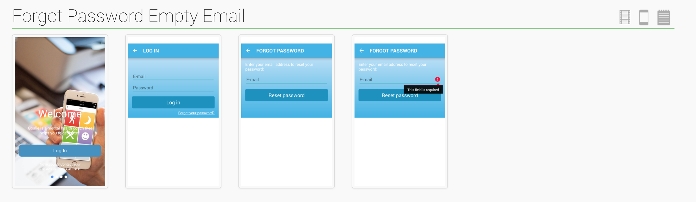
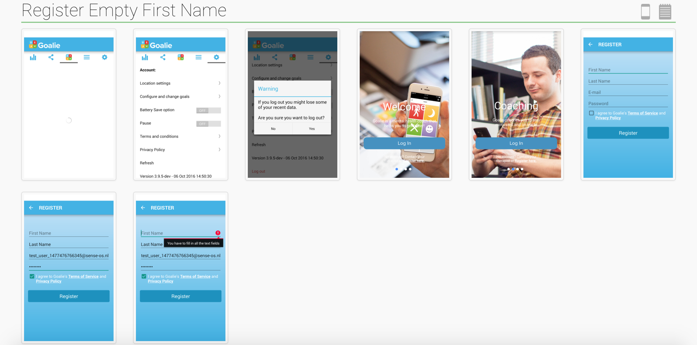

Having run a [small shop](http://www.nerdiacs.com/) for years with only a handful of developers collaborating together on a project it has been a great experience working at [Sense Health](http://www.sense-health.com/) to work with a team of developers collaborating on multiple libraries which are used by various products. With over 20 developers working on lots of different projects, the only problem was that things tend to break far too often as the shared libraries would change for product needs.

To help resolve this I created a [TDD setup](https://github.com/umarniz/AndroidEspressoHelpers) for our Android apps that uses current gen tools in the Android infrastructure to produce reliable tests, CI to trigger tests on demand for teams on top of running suites over weekends all with pretty formatted output that could be shared with the non-technical team to see how things looked.

The final setup used Android [ActivityTestRule](https://developer.android.com/reference/android/support/test/rule/ActivityTestRule.html) to run the Activities. With ActivityTestRule we initialise activities just like they are initialised by the OS allowing us to start activities by passing intents to them when starting and giving us more control on the Activity Lifecycle.

As the application that I needed to test does not support starting activities that can run mid way through the application and has to start the app from a base activity (which initialises all the classes and data stores), we quickly ran into the problem of having to do a lot of unnecessary user actions to get to the screen we wanted to test from the Base Activity.

With such a use case hardcoding any test conditions would be a very bad idea as changes in the application would mean changing tests everywhere. For example if we wrote a test that went through the tour screens by clicking the ‘next’ button in a loop and in the next sprint we removed the tour screen then every test that goes through the tour screen would have to be re-written.

To avoid such a problem we used the [Robot Pattern](http://jakewharton.com/testing-robots/) as described by Jake Wharton. Which is essentially what OOP dictates and we extended the design with helper functions for each major screen in the app. The helper functions would promise to get the app to the required screen no matter what state the app currently is in.

Such abstractions allowed us to create tests that were far more readable and easy for the QA team to implement:

```java
LoginRobot.goToHomeScreenWithAnyUser(activityRule);

LoginRobot.logout(activityRule);

onView(withId(R.id.toLogin)) .check(matches(isDisplayed()));
```

In the above test case, we ask the robot to get us to home screen with any user. An overloaded member of such a system would specify whether we wan’t to go to home screen after registering a new user or after logging in with an existing user or with ‘any user’ where we don’t care what user profile we are using to get there.

<figure>



<figcaption>A spoon test showing design problems and testing empty field errors</figcaption>

</figure>

If the applications is already logged in and we want to login with a specific existing user, we make sure we logout and re-login.

With such a scheme in place, the code for a test of RegisterScreen:

```java
String email = generateRandomEmail();

LoginRobot.RegisterUser(activityRule, email, “password”, “”, “Last Name”, true);

// Check error states  
onView(withId(R.id.firstName)).  
check(matches(TestHelpers.hasErrorText(R.string.error\_should\_fill\_all\_fields)));
```

<figure>



<figcaption>Note how the test only has RegisterUser but the app starts by logging the user out and going to registration screen first</figcaption>

</figure>

With such a system in place, testing became a breeze as we can make robots for each key part of the application and reuse them with helper classes to have tests that are closer to natural language. To further extend the system, we used [Spoon](https://github.com/square/spoon) to be able to make pretty HTML reports like above and run tests on all connected devices at once with a simple:

```bash
gradlew spoon
```

Spoon also allowed us to take screenshots of every action we did, and with the robot pattern allows to take a snapshot of how the app looked like each time we went through a screen with a simple

```java
Spoon.screenshot(activity, tag)
```

This works great but due to a limitation in Android this works by taking a screenshot of the current active window, which means that if there is a dialog on top of the current activity then the dialog will not be visible in the screenshot as its not part of the activity window. To fix this I used the [FalconSpoon](https://github.com/jraska/Falcon) library which uses reflection to get screenshots of all windows visible on the screen and merge them in a final screenshot.

So with a system in place now that would run all UI tests on all connected devices, the next logical step was to set this all up in Jenkins on a physical server and connect a couple of devices to it. The final solution goes one step further and uses a bash script to upload the generated HTML report from spoon to github pages for product owners to inspect every day and puts a link on slack.

This way before starting any new feature we can just write a quick test that gets us to the activity and take a screenshot of the activity. Each night the nightly tests would kick in and we could see the progress of each feature as it develops. We have the system to only work on develop branches or trigger via specific commit messages from any branch but you could use this to work over night on every branch.

This coupled with a [Infer + Lint CI setup using Jenkins](https://medium.com/@Rapchik/static-analysis-build-server-for-android-with-jenkins-using-docker-bda888d4b34e#.fbla8yfa7) work really well for a solid Android development environment.

I have open sourced all the custom view matchers and helpers I had to write for our project and also a helper bash script [here](https://github.com/umarniz/AndroidEspressoHelpers).
  