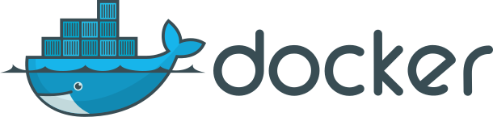
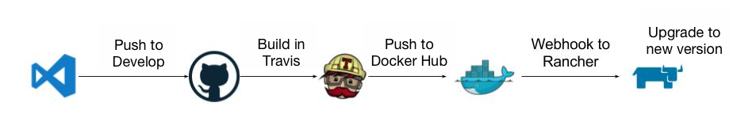

<figure>

<figcaption>Photo by <a href="http://www.gdnordley.com/" className="figcaption-link">G. D. Nordley</a></figcaption></figure>

In my [last article](https://hackernoon.com/revamping-a-legacy-backend-1-1429a4ce77cb) I shared our approach at [Sense Health](https://www.sense-health.com/) to use Infrastructure as Code for creating and provisioning servers. While this gives us a solid base to introduce new clusters into our stack and increases reliability of our servers to run different services and databases, we are still missing a solution to deploy our software.

To give you a scope of the problem, we have a micro-services driven architecture with APIs developed over the last several years in PHP, Python and Go. These services were deployed manually onto 1 server that had been running for years and we had only 1 senior engineer who had enough knowledge to troubleshoot any issues that occurred when deploying.

To be able to confidently move our entire code-base into a new environment and make it easy for engineers to deploy, we had to break-down the problems one step at a time.

**Step 1, Ensure reproducible execution environment**

The first problem when deploying such legacy software, is setting up the environment the software requires to correctly execute in. This ranges from having the right dependencies and tools installed to correct file permissions setup.

The easiest way to solve this problem? Containers!

<figure>

</figure>

I have been a big proponent of containers since I first used [Docker](https://www.docker.com/) and having [blogged about it before](https://medium.com/@Rapchik/docker-in-development-339110a03c22) I will not go into more detail about developing with Docker as there are a lot of great resources about it out there.

**Step 2, Container Orchestration**

Now that we have all our code nicely setup inside containers, we need a way to manage where and how these containers will run.

When using Docker locally, it is quite easy to use [Docker Compose](https://docs.docker.com/compose/) to have all dependencies in one place and test things out locally. While this works well for local development, it is not at all ideal for a production environment (unless you are using [Docker Swarm](https://docs.docker.com/engine/swarm/))

When deploying containers to production we would need tools to manage how and when containers are deployed to different servers and logic to automatically deploy containers to new servers when they are provisioned. Similarly, when upgrading a container image to the latest version we would need some logic to ensure a container is brought down, upgraded and brought up one at a time to avoid down time.

As we are attempting to make it easy for anyone from the development team, without having Dev Ops knowledge, to deploy software to the back-end we decided to use a container management tool with a web interface called [Rancher](https://rancher.com).

<figure>

</figure>

Rancher provides built-in support for a range of container orchestration platforms ([Kubernetes](https://kubernetes.io/), [Cattle](https://github.com/rancher/rancher/wiki/Overview:-What-is-Cattle)) and comes bundled with a plethora of tools (HA-Proxy Load Balancer, Networking Health Checks, etc) to make your life easy when deploying containers. It also gives you the perfect tools for access control (Active Directory, LDAP) and allows you to manage all your environments (Staging, Production) from a single interface!

We used Terraform and Ansible to provision a Rancher Server and attach a few Rancher Agents for our staging environment to test it out. After a few weeks of testing, we were confident that the environment was working well enough and hence decided to streamline the workflow.

**Step 3, Continuous Integration**

With [docker being used in development,](https://medium.com/@Rapchik/docker-in-development-339110a03c22) our setup already encouraged most of our developers to work on any of the back-end services quite easily but there was still some manual effort needed to push new changes to staging servers.

With Rancher we had already made it extremely accessible for any developer to initialize a container on the staging servers without any involvement of a Dev Ops engineer, but the final step to the chain was introducing continuous deployment to the existing stack.

To do this we used our existing Travis CI build setup to build Docker images whenever a commit was merged to Develop and then upload them to [Docker Hub](https://hub.docker.com/). Docker Hub would then fire a web-hook to Rancher requesting it to upgrade the running service and pull the latest staging image from Docker Hub.

<figure>

<figcaption>Continuous Deployment to Staging</figcaption></figure>
  