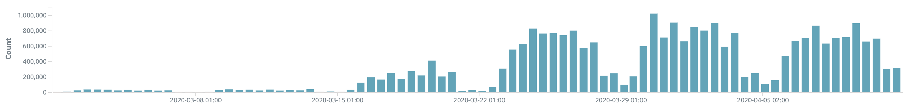
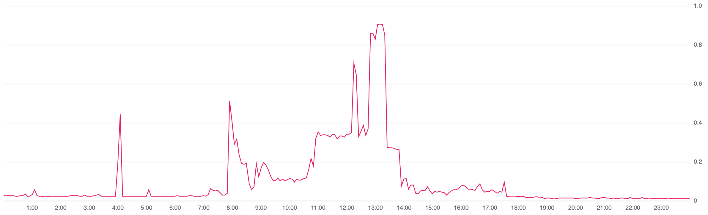
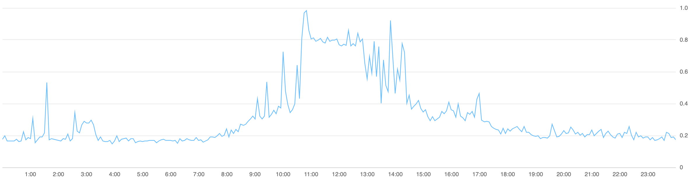
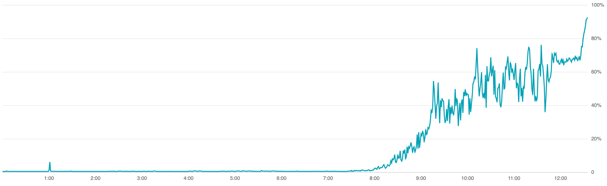
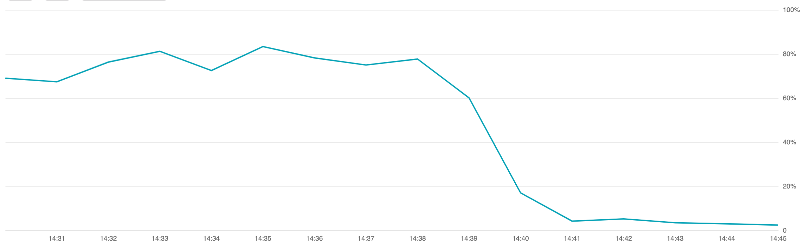

In these tough times we are all trying really hard to play our part to help bring the world back to normal or perhaps the ‘new’ normal that comes once we have contained and controlled this pandemic.

At [NiceDay](https://nicedaycoaching.com/), we have always believed the future of mental health care to be need driven. This means providing care to people who need it the most and at the time that they need it. This means providing care to clients exactly when they need help no matter where they are.

In this time where the world needs new ways to work digitally, we are helping make sure that thousands of treatment sessions a day that might not have taken place can happen. Our entire team has been hard at work to embrace all the mental health organisations that want a new way to provide mental health to their clients, a solution that is not just video calling at a distance but a completely new way to work.

In the last few weeks we have seen an immense growth in our user base and have grown over 20x. Such a surge in growth in a short period is no easy task to handle but we faced this surge of people looking for help by the entire team improvising our roles to provide a fundamentally great NiceDay experience to everyone who needed it.

<figure className="wide-width-figure">

<figcaption>Incoming Requests</figcaption></figure>

As such a growth spurge is a very new challenge for us, I want to share our story, what we did to facilitate all the users and the moves we had already made in the past which helped us a lot in these times.

### **Scaling Up 🚀**

We knew from early March that if the situation with the pandemic was to get worse, NiceDay might become the core tool of choice for our partner organisations but we did not have any idea on the number of users to expect and when to expect them.

In the 2nd week of March as a lockdown was introduced in the Netherlands, we were bracing for a surge but were still uncertain on the impact this might have on us.

The next Monday we were seeing a spike unlike ever before. ~50x more signups in a single day then the previous week. The servers were being crushed and everything was slowing down to almost a halt, it was a bear hug from all our new users!

Having a pretty stable infrastructure that I have [detailed in the past](https://medium.com/sense-health/revamping-a-legacy-backend-1-1429a4ce77cb) and an extensive monitoring + alerting setup. We quickly found out that our chat database ([MariaDB](https://mariadb.org/)) was completely overwhelmed with all the incoming requests.

<figure className="wide-width-figure">

<figcaption>Load across all the entire MariaDB cluster</figcaption></figure>

Having a cluster of MariaDB with all masters, we immediately upgraded one of our nodes to be 8x its size and specified our load balancer (HAProxy) to use this instance first for all incoming requests and only if this server was down to redirect requests.

This ensured MariaDB had enough CPUs to perform all incoming queries and increased the [buffer pool size](https://mariadb.com/kb/en/mariadb-memory-allocation/#what-is-the-buffer-pool) with the new amount of RAM we had to further speed up performance.

With the database stabilised, we now had an enormous load on our chat server ([Ejabberd](https://www.ejabberd.im/)) which was getting all these responses from the database really fast and getting all these requests from our end users but didn’t have the capacity to process them fast enough. All cores were utilised a 100% and as the chat server was running in a container on a server which had other services running on it as well, it was slowing down everything on the server as the cache kept getting smashed by Ejabberd.

<figure className="wide-width-figure">

<figcaption>CPU load on the Rancher Agent with Ejabberd</figcaption></figure>

We spawned a new server which was 8x the size of our current chat server and pinned only the chat service to this server and voila, our entire service stabilised. The response times on our main backend were still a bit slow but the whole experience of the product was quite good and the bear hug was converted to a tight embrace :) We had survived the first wave!

The 1st wave of problems solved, our infrastructure team decided to do a daily morning standup everyday from then on to monitor the situation. This worked specially great as our infrastructure team is in our Bandung office in Indonesia which means their 9 AM is 4 AM CEST and all our users are in CEST! We would look at the statistics from the previous day and upgrade our servers accordingly. The goal was to make sure no server reached more than 30% usage, we were saving rest of the capacity for unknowns that might come up during this time of scaling up.

While the infrastructure team was busy optimising the servers to make sure all clusters were sufficiently capable to handle incoming load, the development teams were in action to pickup quick stories to improve the experience of our users.

With so many new users our support team was getting overwhelmed with a huge amount of questions! Dutch speaking members of our tech team joined the support team to help investigate technical questions and we formed an FAQ sheet to identify key questions coming in from users.

As a problem got reported more often, the UX team would brainstorm with someone from the tech team and identify a quick solution for it and the dev team would pick it up to release as a hotfix! This way, we made sure new users can have a great experience and our support teams aren’t overloaded with requests so they can answer all incoming questions in a short time.

### **The 2nd wave 🌊**

With the user growth we were seeing, we were running into practical restrictions that we didn’t care about in our initial development. We had for e.g a limit of 1000 therapists that would be visible in our portal, as we were loading only 1 page of data instead of looping through all the therapists available in our product but no-one tested the behaviour if you had > 1000 therapists!

After a week and a half of hot-fixes and rapid releases with the QA team working extra hard to do their testing, we were starting to receiving great reviews from lots of teams about how great an experience they were having with NiceDay!

Even in this time of rushing to scale up, members of our team didn’t forget their sense of humour ;)

<figure>

<figcaption>Our newly added server. rancher-agent-<b>CV19</b> reporting for duty!</figcaption></figure>

### **Things start going sour**

Meanwhile, we had almost our entire infrastructure under control but were still facing high load on our chat server. Even with 64 cores our chat server was still under immense pressure and reaching up to 80% usage at peak times!

We knew we had some inefficiencies in the way we load chat history in our code and were already busy building a hot fix for it but time was running out as our clustering was failing in the chat server due to an unknown bug in our setup and our single instance was already pushed to 64 cores, the only option available above this was a 96 core system which we had already setup for standby to take over!

<figure className="wide-width-figure">

<figcaption>Even with a 64 core node, the server is heading towards certain failure!</figcaption></figure>

Our infrastructure lead got a great clue when going through the [information schema](https://mariadb.com/kb/en/information-schema/) in the database of our chat server and noticing that 2 of the tables _mod_caps_ and _sr_user_ were queried over a billion times! Having worked with Ejabberd for a few user, we knew these tables were used by the Shared Rosters feature which we use to add users into groups to allow users in a group to see each others presence status (i.e whether they are online or not).

With the pressure mounting and we approaching peak hour of the day, we saw the load of our chat server crossing 100% we were already getting reports of chat running slow and were running out of time!

In this moment of pressure, we realised that the problem was rooting from the fact that _shared_roster_ was doing a query in the database every time anyone had changed their presence status (i.e went online/offline/busy) and then had to broadcast this change to every user!

This small presence feature turned out to have a deadly chain reaction completely crumbling our chat server. We immediately shut down the feature and saw the load on the server go down to ~5%!

<figure className="wide-width-figure">

<figcaption>I would like to ski down that slope!</figcaption></figure>

While fixing the problem, our intention was to enable caching in the Shared Roster feature in Ejabberd but unbeknown to us this actually wasn’t supported in the version of Ejabberd we were using and hence caused an incorrect configuration error which is why Ejabberd had just shut down the feature which shed all load!

This just goes to show how much knowledge and luck you need in high pressure situations like this to reliable handle problems.
  