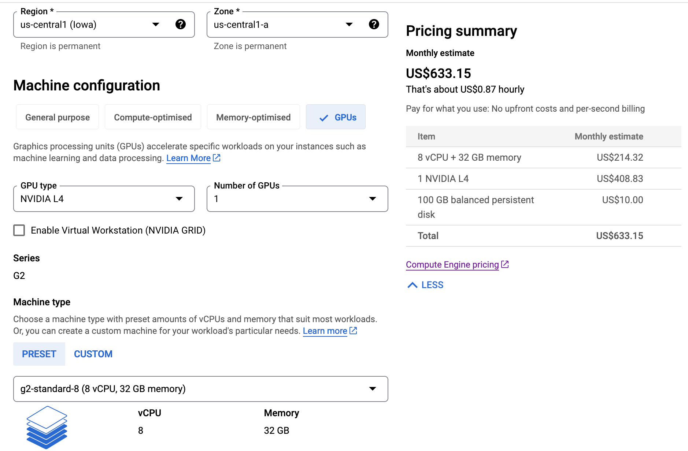

<figure>


<figcaption>AI generated art using DALL·E 2</figcaption>

</figure>

With release of the new large language model [Falcon LLM](https://falconllm.tii.ae/) which topped the [Open LLM leaderboard](https://huggingface.co/spaces/HuggingFaceH4/open_llm_leaderboard) and is a truly open source model i.e also free for commercial use, I have been itching to prototype some ideas and the capabilities of this system.

Thanks to some cutting edge advances in the technoloy underlying large language models it is now possible for an individual hobbyist to run the model in the cloud with a comparitively low budget.

To try out the model, I initally bought [Google Colab Pro](https://colab.research.google.com/signup) to play with the model as it allows you to use premium GPUs for the low cost of €11 / month. Unfortunately, with this price you only get 100 compute units which is an abstract unit google has come up with and translates to around 6.6 hours of run-time for the A100 GPU that Google Colab provides.

It didn't take me long to go through this limit and I realised that I needed a more permanent solution to focus on the development stress free. After trying several different solutions online, I landed on my old go-to strategy whenever I need high compute power i.e setting up a VM in a cloud provider AWS/GCE.

When working with a cloud provider, first and foremost thing to do is to setup billing alerts or caps. You don't want to have a horror story of having to pay thousands of euros in costs because you forgot to turn off your VM.


The most cost efficient VM instace I found on a public cloud provider was to run this was on GCE with an NVIDIA L4 (24GB VRAM) for around $0.87 / hour. I could see much cheaper instances on [VastAI](https://vast.ai/) but \<$1/hour seemed quite reasonable for the reliability that GCE provides.

As its a side project, I would be surprised to do have this machine on for more than 15 hours a week which results in ~$50/month if I am being quite productive.

<figure>



<figcaption>NVIDIA L4 (24GB VRAM) + 32GB RAM to be able to load the instruct checkpoint in memory</figcaption>

</figure>


To try out the LLM model itself, I would recommend trying out the example on the [falcon-7b-instruct model page](https://huggingface.co/tiiuae/falcon-7b-instruct).

I asked Falcon-7B:

`What is the meaning of life?`

```The meaning of life is a philosophical or religious question that has been asked for centuries. There are many different beliefs and theories about life, ranging from a belief in a higher power to the idea that each individual should create their own meaning. Ultimately, the meaning of life is up to you to determine.```