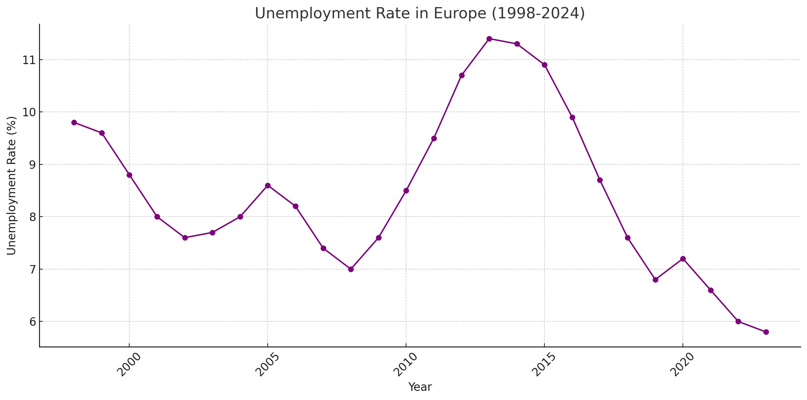

A statistic that recently surprised me; Even though a lot of people feel the current job market is tough, there are approximately 1.2 vacancies per unemployed person in developed countries [(source)](https://www.mckinsey.com/mgi/our-research/help-wanted-charting-the-challenge-of-tight-labor-markets-in-advanced-economies).

There are more jobs than people looking for jobs.

I know, ofcourse these are not the jobs a lot of us want but on the other hand unemployment rate is on historically low levels in developed economies. So most of us do have jobs which are better than the ones available.

<figure >

</figure>

While we seem to be content enough to not leave our jobs and be un-employed (as per the un-employment data) on the other hand the people we as a society want are very hard to come by.

There is a [significant talent shortage](https://www.forbes.com/sites/tracybrower/2024/02/12/yes-the-talent-shortage-is-real-what-you-must-know-to-attract-and-retain/) in developed economies and it is becoming increasingly difficult to fill expert roles. It is getting harder to hire and retain skilled indiviudals. There are many reasons about why this is happening but one point that I would like to focus on is the low motivation to work in the first place due to the lack of purpose.

With an increasing moral awareness in developed economies more and more people are starting to question their contribution to a system they see as destructive and unsustainable. 

Why bother working 40 hours for a job to further fuel this system that seems to accelerate us towards the end of human existence?

This low motivation to work, coupled with a heightened moral awareness, is gnawing at us from within. We see this in the rising rates of burnout, especially in advanced economies. I am not saying this is what causes burnout but not having purposeful work is definitely a strong contributor. Consider the educated consultant writing reports to help banks earn more money or the creative professional who once relished the challenge of producing high-budget videos, only to be struck by the futility of yet another shampoo ad.

> In a world full of moral awareness, purpose is the unicorn.

As we advance towards a future where the efficiency of human effort increases exponentially, we will be forced to rethink many of the norms we take for granted today. There has been extensive discussion on this topic, and ideas like [Universal Basic Income](https://www.notion.so/Purpose-and-the-future-of-work-7debc8bfada94019ba25fa0dca673b76?pvs=21) are currently among the most promising solutions, supported by people across the political spectrum.

As society gradually adapts to this new economy, ventures that prioritize purpose over profit will have an enormous potential to lead the market. Access to experts, which is already an issue will become the greatest shortage we face and companies that fullfill the underlying need for purpose will be in a prime position to lead in the new economy.

Companies that prioritise purpose over profit and strongly contribute to social problems will have the highest chance of aquiring and retaining experts that can actually solve the underlying issue at hand. 

While helping build [NiceDay](https://nicedaynederland.nl/) in the last 8 years, a mental health tech company with a goal of prioritising purpose over profit, I witnessed first hand the immense power we had with purpose. It helped resolve many of the issues startups face. From aquiring incredible talent to business development as long as the purpose was clear, in our case to make therapists more efficient and hence help treat more patients, everyone jumped in to help.

I noticed many issues that industry experts were talking about from difficulty in hiring to difficulty in business development just weren't an issue I faced. Perhaps it was luck or sense of optimism but I strongly believed it was the clear underlying vision of purpose over profit.

Even though NiceDay didn't achieve the global impact or success I had hoped for, the experience showed me how much simpler and more effective it is to build a company when purpose comes first.

To support the creation of purpose-driven ventures, there is already significant traction behind legal concepts like [Steward Ownership](https://purpose-economy.org/en/whats-steward-ownership/), which provides a legal framework to ensure that companies stay true to their underlying mission. This is not a new unproven model either, from massive clothing brands like like [Patagonia](https://medium.com/@purpose_network/the-patagonia-structure-in-the-context-of-steward-ownership-e9db3d260dc6) to forward-thinking search engines challenging Google's monopoly like [Ecosia](https://purpose-economy.org/en/companies/ecosia/) are Steward Owned. 

We are still collectively figuring out how to build this new purpose first economy with models like [B-Corp](https://www.bcorporation.net/en-us/) and alternative economic principles as laid out in [Doughnut Economics](https://doughnuteconomics.org/). 

I do see clearly that there is a gap between the for-profit and non-profit company structures that we have today. 

Traditional for-profit models tie monetary and voting rights together with no external accountability. This works well enough until the company needs to raise capital and who-ever invests in the company also gets right to vote on the companies purpose. There are countless examples of how this has skewed companies into share-holder value maximising machines and we have countless examples today of this going really wrong for us collectively as a species.

On the other hand non-profits are focussed on solving crucial problems that lack a profitable business model but are dependent on beneficiaries to survive. This makes them highly dependent on the global economic situation and the good-will of beneficiaries, resulting in high short-term impact but a lower likelihood of sustaining in the long run.

I feel there can be a middle ground between the two model with a sustained long-term impact. A midle ground where share-holders do get returns but the returns are capped and executives get great salaries but their salaries are capped e.g not be more than the president of the country. Steward ownership solves the underlying problem of purpose being lost over time by splitting monetary rights from voting rights and in-turn preserving the underlying moral vision in the long-term.

This would result in a model where excess revenues are invested to help improve things in the problem domain itself. If its a mental health company then excess funds to improve mental health in developing countries, if its an alternative-food company then excess funds to help accelerate research in alternative-proteins. 

By reinvesting excess revenue into addressing social issues—whether through donations to restore ecosystems or building grassroots movements in developing countries within the same sector—we can bridge the gap between profit-first and non-profit companies and create sustainable impact over the long-term.

I am not sure where this exactly leads to but I do believe there is a significant gap between for-profit and on-profit companies and I feel the lack of purpose we are feeling as a society can be a strong fuel to help bridge this gap and eventually create sustainable social change.

If you found this topic interesting, feel free to reach out! Having worked at the intersection of tech and entrepreneurship with a strong drive for social impact, I'm always open to discussing potential collaborations to make a bigger impact together.