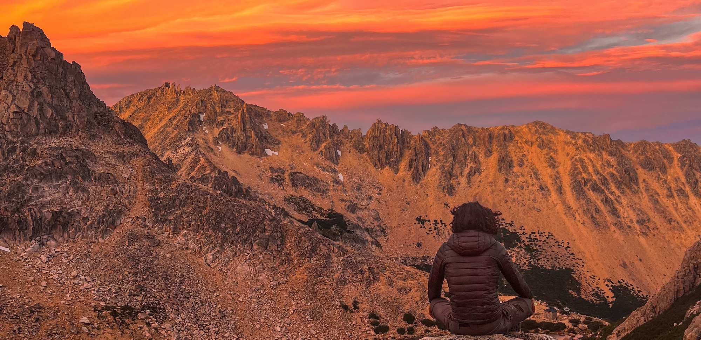
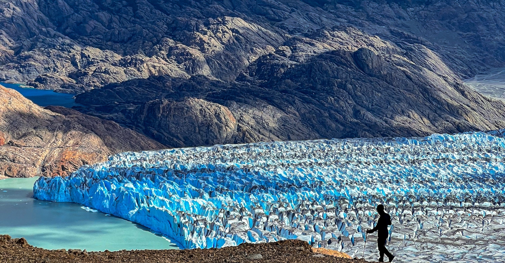
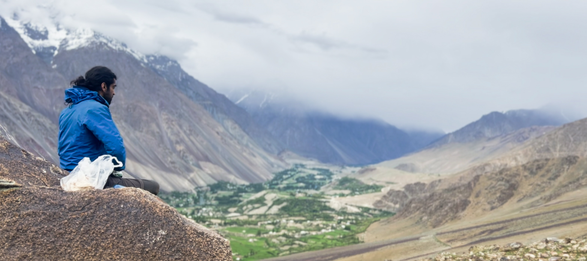
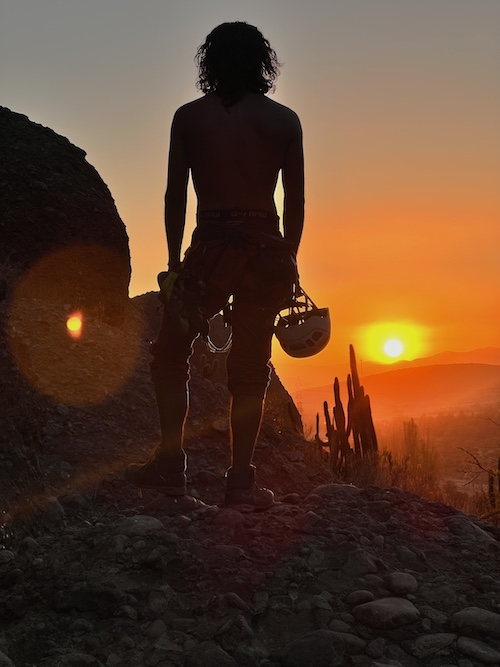
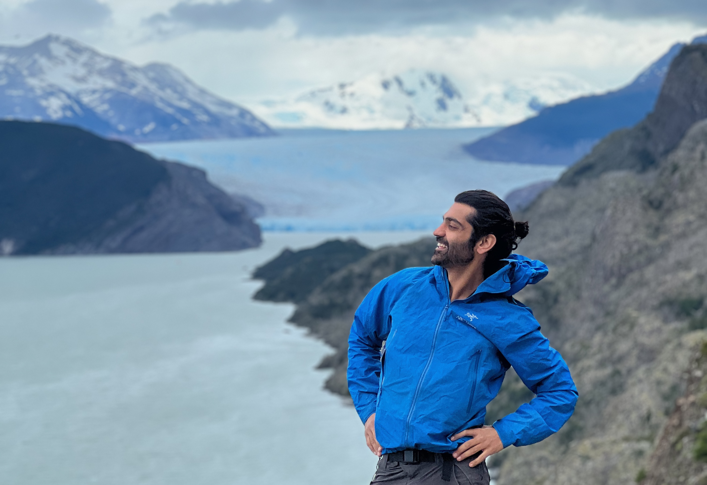

I have spent the last 7 months of my life traveling over 45,000 km and [journaling my experiences](/journal) during this time. Traveling mainly in Argentina, Chile, and Pakistan, I have met incredible people who have redefined my outlook on life as I look forward.

From [Dylan & Chirley](/2024-01-26-San%20Carlos%20de%20Bariloche), selfless to the point they welcome strangers with the warmest hugs into their house with free access to kayaks and love you like family just because of their unwavering religious faith, to [Mar](/2024-02-05-Piedra%20Parada), the 57-year-old woman climber who held my hand and taught me how to become a better climber. These experiences have had a profound impact on me, making me realize deeply who I am and the life that lies ahead of me.

<figure>

<figcaption>Meditating at Refugio Frey, Argentina</figcaption></figure>

It wasn't easy at the start of my sabbatical to not be productive. I woke up questioning myself: Why am I here? I'm not burnt out; I have energy and ideas. Why don’t I just start building something? If I don’t want to build something, why not volunteer my time somewhere to help the needy? Such a waste of a productive being!

The self-judgment kept rolling. I was constantly criticizing a projection of myself that was complete and infallible. If I am as strong as I believe I am, then what is the point of taking this break? Why am I taking a one-way flight all the way to South America and adding a ton of greenhouse emissions to this already fragile environment?

It took me several weeks to get out of this mindset and embrace its underlying selfishness. In my life, I prioritize humans and all that I can do to help improve life for me and my fellow beings as a whole. In this pursuit, I have to accept my humanity — my fragility in wanting things, my selfishness in having desires for myself, as I am but human myself.

<figure>

<figcaption>Hiking the Huemul Circuit, Argentina</figcaption></figure>

Never having taken more than two weeks off work since I was 16, my desire was to experience what would happen if I took a break — to explore the freedom my new Dutch passport gives me while I don't have responsibilities requiring me to stay in one place. I needed to understand my intrinsic fear of not finding anything fulfilling in life except work, and my urge to expand my circle of thought by slowly and deliberately interacting with people from all walks of life.

An unplanned adventure where I lived hour by hour, jumping off the bus mid-journey because I felt like the town where the bus stopped was where I should be. Flipping a coin to decide whether to go north or south. From being a carpenter when someone needed a hand to upgrade their camper van, to being a firefighter when water needed to be brought up a hill to beat forest fires. I lived life with no expectations and no plans, living life like a darvesh.

What followed was my inner self, familiar especially in work settings, exemplified in everyday life.

<figure>

<figcaption>Hiking in Phandar Valley, Pakistan</figcaption></figure>

I had random encounters and deep conversations with people from every walk of life — from burnt-out hedge fund managers to goat herders, from professional mountaineers to pot-head teenagers, from ex-convicts. Some were lost in life and traveling to avoid responsibilities, and some whose purpose was clear even during a holiday. Each had their own wisdom, some gaining it through books and others through nature. My interactions with the young and old left me in awe at the rich variety of experiences we humans have. Strangely enough, no matter what your background was, we all experienced the same emotions, just in different words.

From farmers growing up in the middle of nowhere in Argentina to those who grew up in a metropolis, from those speaking Spanish to those speaking Burushaski, whether we talked about me coming out of my long-term relationship or someone talked about the feeling of having a newborn, we all understood grief and joy exactly the same.

Divided by society, opportunities, race, religion, but united by the same inherent emotions we all experience. The Homo sapiens is nothing but a self-conscious puppy drowning in the weight of its own consciousness.

With a one-way ticket and no fixed deadline for my travels, my approach to the sabbatical was simple. Every few weeks, I would sit down and process my thoughts, asking myself: Do I have the answers I am looking for?

I didn't even know the questions, but I trusted my instincts enough to know I would be honest with myself if I came close to the answers. It is difficult to embrace such a method unless, first and foremost, you can be honest with yourself and, secondly, you can trust the process completely.

I have always approached complex life decisions in a similar fashion — slowly separating emotional thoughts from the rational and eventually coming closer to the answer I am looking for.

It took me several months to get closer, but halfway through a long hike in the mountains, I had a powerful realization.

**I can also enjoy life without work.**

<figure>

<figcaption>Rock climbing at Las Chilcas, Chile</figcaption></figure>

Before my sabbatical, I met a senior investor who is successful in every definition of entrepreneurship you can write. We were having lunch when he had an honest moment and said:

*"Umar, you know what it is, I don’t have any hobbies. All I know how to do is work. I have tried retiring many times, but it takes me a few weeks before I am back to work."*

At that time, I was considering what to work on next, and this conversation had a profound impact. I love working, but I don't want to be a slave to work. I want to build lots of new products, but the thought of ‘I have to work’ instead of ‘I want to work’ seemed quite sad, especially when money isn’t the issue.

Four months into my sabbatical, I had the answer. I can enjoy life without work, as long as I am close to the mountains.

Since then, I have been quietly researching some ideas and thinking about what to build next. I don't know exactly what I will be working on in the coming months or where I will be living to be closer to the mountains, but I do know that I am excited to build more companies that prioritize purpose over profit.

It has been two days since I've been back in Rotterdam, and it feels strange to be back here. On one side, I am really excited to meet all my friends and colleagues again, and on the other, it is surreal to be in an apartment in the city center, far away from mountains.

As a friend explained, it feels strange to be back because it looks like nothing has changed, but I have.

<figure>

<figcaption>Hiking Torres Del Paine, Chile</figcaption></figure>