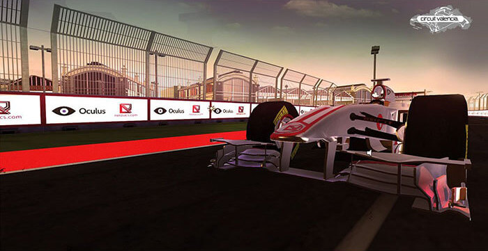

<figure >

</figure>

Being passionate about VR, we at Nerdiacs decided to build a demo to showcase the immersion of driving a F1 car. We spent 3 weeks in which we recreated the Circuit Valencia track inch by inch. The final  experience uses an XBox steering wheel and the Oculus Rift to experience the thrill of high speed racing. The event was showcased at T2F Karachi and received an amazing response from the crowd showing the future of  technology.

import circuit_valencia_demo_poster from "./circuit-valencia-demo-poster.jpg"

<VideoPlayer mp4="https://vz-33746591-537.b-cdn.net/4b0844ab-f511-4a49-b4f5-18e8be8d5b1f/play_720p.mp4" autoPlay={false} controls={true} preload="none" poster={circuit_valencia_demo_poster} caption="A video showing the circuit valencia demo showcase at T2F Karachi, Pakistan" />

## Summary

-  Sole Programmer responsible for end to end development 
-  Connected an XBox steering wheel to Unity via XInput 
-  Integrated leap motion for hand/finger detection 
-  End to end development with art in 3 weeks as a VR showcase 
