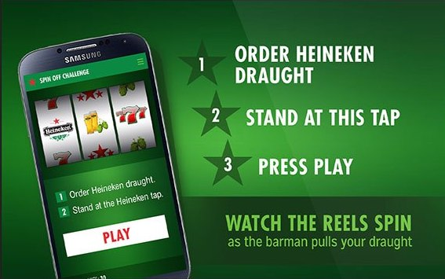
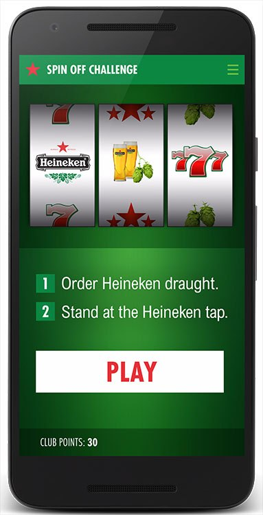

Barrows Global wanted to do a marketing campaign for Heineken to gamify getting a beer in a bar. The concept was to have a Heineken app that would automatically detect when you enter a bar and order a beer. For each beer that you order, you get a token to play a spinoff challenge and if you win the challenge, you get a free beer.

Technically for this, a custom beer tap was created with a flow meter in it connected to an Arudino. This Arudino was connected to a tablet with a custom app for the bartender to see if someone won a free spinoff.

The client who ordered the beer would have an Heineken app installed on their phone. An iBeacon service was created to detect if the client was close to the tablet (i.e the bartender) which would trigger a push notification as soon as the client came close to the bartender.

The app would then know when a beer glass was full (the Arduino would send a message to the tablet which would send this information to the phone) and offer the user a chance to play the spinoff game.

<figure >

</figure>

<figure >

</figure>

## Summary

* Sole Programmer responsible for end to end development
* Built 2 different applications for tablet and phone.
* Custom spinner component built with Paint API
* UDP Broadcast discovery between tablet and phone
* Tablet arduino connection via OTG cable
* Custom Arduino code connected to flow meter
* iBeacon service in background to detect proximity from tablet