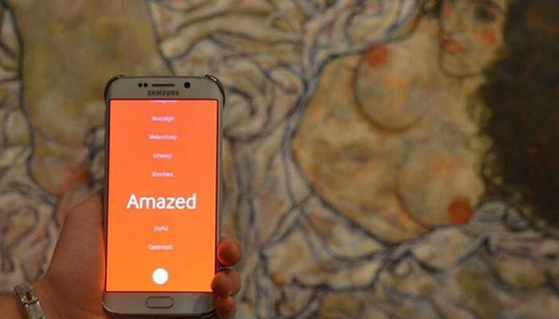

<figure >

</figure>

Samsung wanted to present the Samsung S7 as a device for art lovers. To enable this vision, we developed an android application for a showcase event at Leopold Museum, Austria where viewers could interact with the paintings by sharing their emotions.

import aof_demo_poster from "./art-of-feeling-demo-poster.jpg"

<VideoPlayer mp4="https://vz-33746591-537.b-cdn.net/4d65ea1a-fa44-4502-800b-f3bbc7447915/play_720p.mp4" autoPlay={false} controls={true} preload="none" poster={aof_demo_poster} caption="A video showcasing the Samsung AOF event. Video courtesy Samsung & Leopold Museum." />

## Summary

* Lead the project with 2 developers
* Low CPU high memory Gaussian Blur implementation to create mixing blob effects on mobile.
* Custom map component that allowed zooming based on specified room areas.
* Automated the map component by creating a Photoshop script that exported xml from the PSD with map markers to set bounds and zoom accordingly
* App testing using static code analysis (Lint + Infer) and unit tests on a Jenkins build server. [Link to blog post](/static-analysis-build-server-for-android-with-jenkins-using-docker)